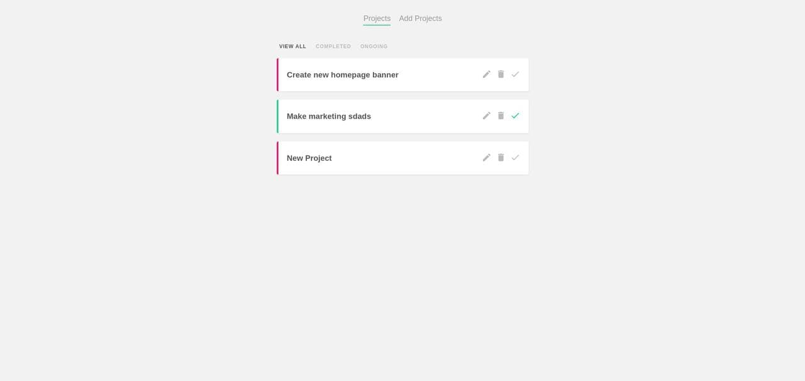
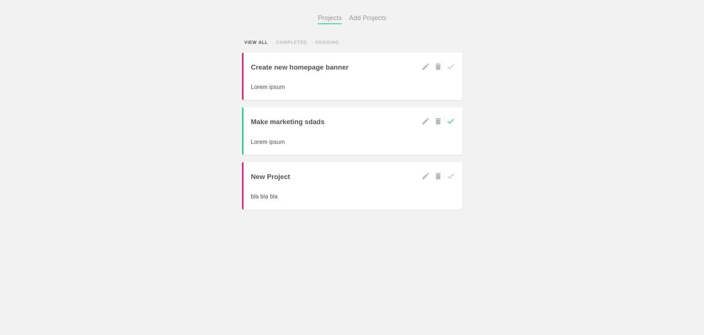
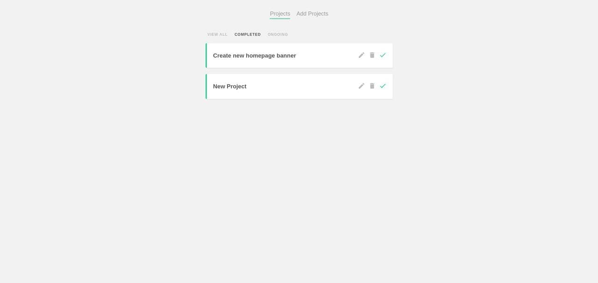
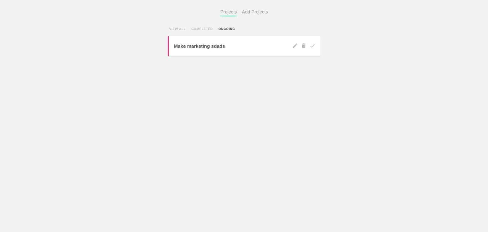
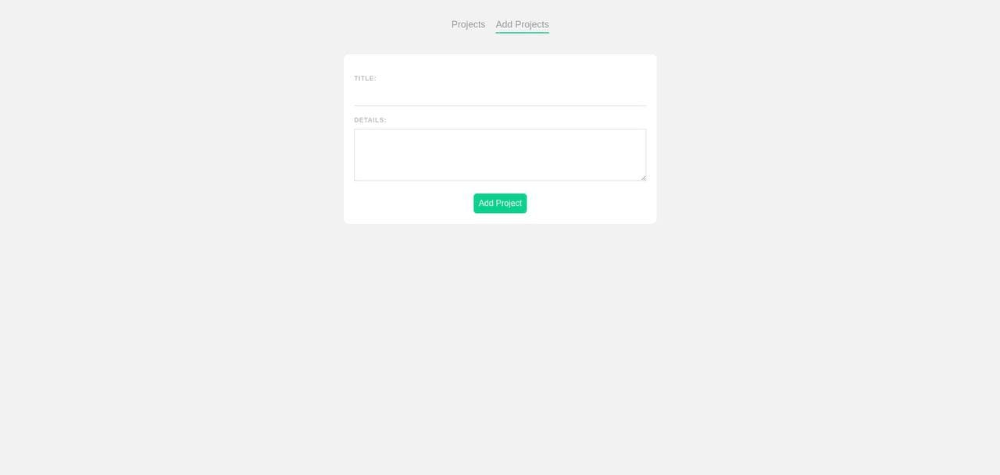
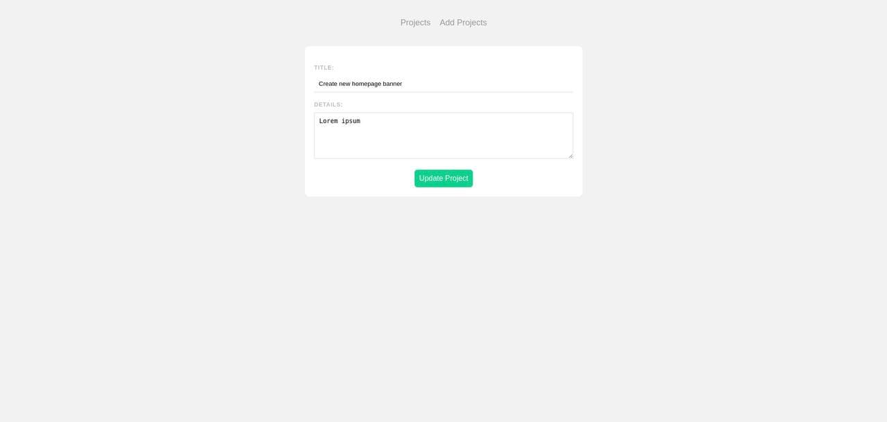
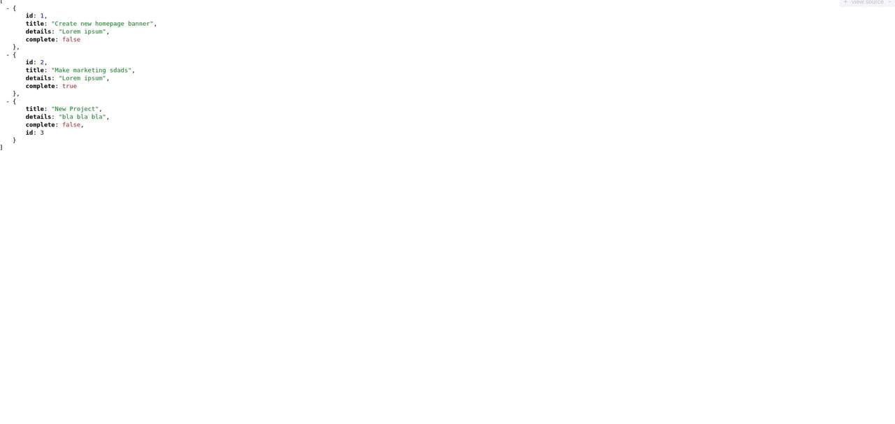

# vue-project-planner

## Project setup
```
npm install
```

### Compiles and hot-reloads for development
```
npm run serve
```

### Compiles json data
```
npm run server
```

### Compiles and minifies for production
```
npm run build
```













